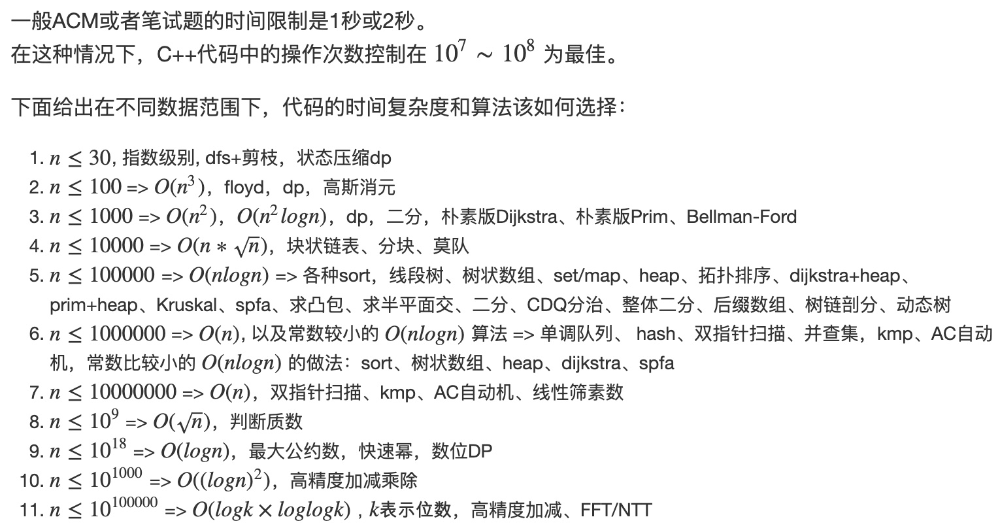

# 数据范围
```c++
int8    [-128, 127]
int16   [-32768, 32767]
int32   [-2147483648, 2147483647]
int64   [-9223372036854775808, 9223372036854775807]

uint8   [0, 255]
uint16  [0, 65535]
uint32  [0, 4294967295]
uint64  [0, 18446744073709551615]
```

[由数据范围反推算法复杂度以及算法内容]([由数据范围反推算法复杂度以及算法内容](https://www.acwing.com/file_system/file/content/whole/index/content/3074/))

