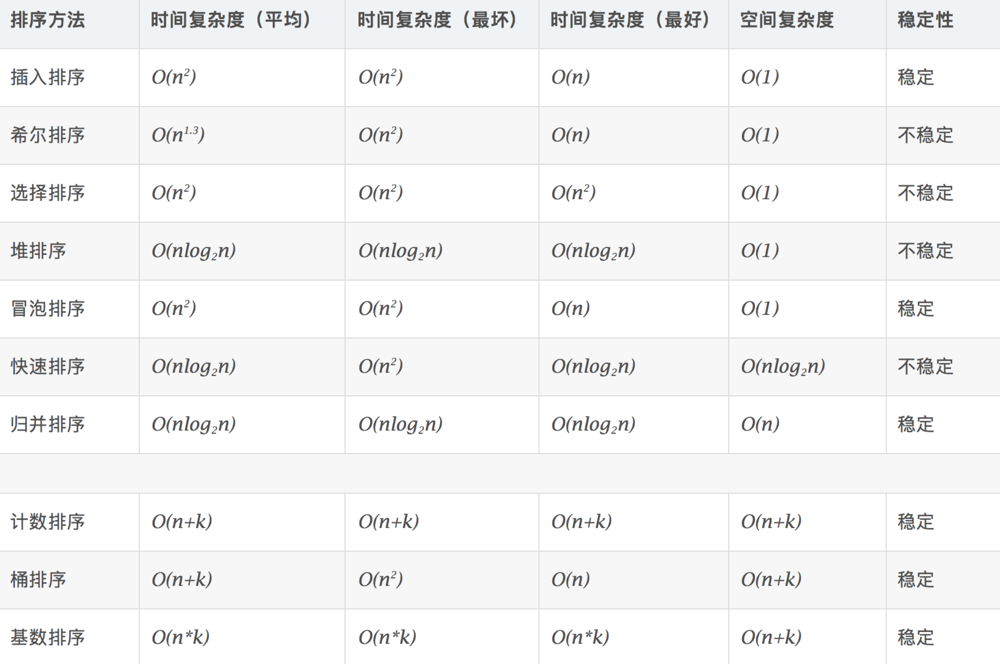

# 排序

## 比较类排序

### 交换排序
* 冒泡排序  
嵌套循环，每次查看相邻的元素如果逆序，则交换。

* 快速排序
数组取标杆 pivot，将小元素放 pivot左边，大元素放右侧，然后依次
对右边和右边的子数组继续快排；以达到整个序列有序。  
```c++
#include <iostream>
#include <cstdlib>

void swap (int& a, int& b)
{
    int tmp = a;
    a = b;
    b = tmp;
}

int partion(int a[], int f, int e)
{
    int i = f;
    for (int j = f; j < e; j++)
    {
        if (a[j] < a[f])
        {
            swap (a[++i], a[j]);
        }
    }
    swap (a[i], a[f]);
    return i;
}

void quickSort(int a[], int f, int e)
{
    if (f < e)
    {
        int i = f + rand() % (e - f);
        swap(a[f], a[i]);
        int mid = partion(a, f, e);
        quickSort(a, f, mid);
        quickSort(a, mid + 1, e);
    }
}

int main()
{
    int a[] = {6, 7, 0, 3, 2, 4, 5, 8, 9, 1};
    quickSort(a, 0, 10);
    for (int i = 0; i < 10; i++)
    {
        std::cout<<a[i]<<" ";
    }
    std::cout<<std::endl;
    return 0;
}
```

### 插入排序
* 简单插入排序
从前到后逐步构建有序序列；对于未排序数据，在已排序序列中从后向前扫描，找到相应位置并插入。
```c
#include <iostream>

void insertSort(int a[], int n)
{
    for (int i = 1; i < n; i++)
    {
        for (int j = i - 1; j >= 0 && a[j + 1] < a[j]; j--)
        {
            int tmp = a[j];
            a[j] = a[j+1];
            a[j+1] = tmp;
        }
    }
}

int main()
{
    int a[] = {6, 7, 0, 3, 2, 4, 5, 8, 9, 1};
    insertSort(a, 10);
    for (int i = 0; i < 10; i++)
    {
        std::cout<<a[i]<<" ";
    }
    std::cout<<std::endl;
    return 0;
}
```

* 希尔排序
```c
#include <iostream>

void shallSort(int a[], int len)
{
    for(int grap = len / 2; grap > 0; grap /= 2)
    {
        for(int i = grap; i < len; ++i)
        {
            for(int j = i - grap; j >=0 && a[j] > a[j + grap]; j -= grap)
                std::swap(a[j], a[j + grap]);
        }
    }
}

int main()
{
    int a[] = {6, 7, 0, 3, 2, 4, 5, 8, 9, 1};
    shallSort(a, 10);
    for (int i = 0; i < 10; i++)
    {
        std::cout<<a[i]<<" ";
    }
    std::cout<<std::endl;
    return 0;
}
```

### 选择排序
* 简单选择排序  
每次找最小值，然后放到待排序数组的起始位置。
```c
#include <iostream>

void selectSort(int a[], int n)
{
    for (int i = 0; i < n; i++)
    {
        int pos = i;
        for (int j = i + 1; j < n; j++)
        {
            if (a[j] < a[pos])
            {
                pos = j;
            }
        }
        if (pos != i)
        {
            int tmp = a[i];
            a[i] = a[pos];
            a[pos] = tmp;
        }
    }
}

int main()
{
    int a[] = {6, 7, 0, 3, 2, 4, 5, 8, 9, 1};
    selectSort(a, 10);
    for (int i = 0; i < 10; i++)
    {
        std::cout<<a[i]<<" ";
    }
    std::cout<<std::endl;
    return 0;
}
```

* 堆排序
1. 数组元素依次建立小顶堆   
2. 依次取堆顶元素，并删除 
```c
#include <iostream>

void heapation(int a[], int pos, int len)
{
    int left = pos * 2;
    int right = left + 1;
    int root = pos;
    if (left < len && a[left] > a[root])
        root = left;
    if (right < len && a[right] > a[root])
        root = right;
    if (root != pos)
    {
        std::swap(a[root], a[pos]);
        heapation(a, root, len);
    }
}

//创建最大堆
void createHeap(int a[], int len)
{
    for (int i = len / 2; i >= 0; i--)
    {
        heapation(a, i, len);
    }
}

void heapSort(int a[], int len)
{
    createHeap(a, len);
    for (int i = 0; i < len; i++)
    {
        std::swap(a[0], a[len - i - 1]);
        heapation(a, 0, len - i - 1);
    }
}

int main()
{
    int a[] = {6, 7, 0, 3, 2, 4, 5, 8, 9, 1};
    heapSort(a, 10);
    for (int i = 0; i < 10; i++)
    {
        std::cout<<a[i]<<" ";
    }
    std::cout<<std::endl;
    return 0;
}
```

### 归并排序
* 二路归并排序  
1. 把长度为n的输入序列分成两个长度为n/2的子序列；  
2. 对这两个子序列分别采用归并排序；  
3. 将两个排序好的子序列合并成一个最终的排序序列。 
```c
#include <iostream>

void mergeArray(int a[], int f, int m, int e, int tmp[])
{
    int i = f, j = m + 1;
    int k = 0;
    while (i <= m && j <= e)
    {
        if (a[i] < a[j])
            tmp[k++] = a[i++];
        else
            tmp[k++] = a[j++];
    }
    while (i <= m)
        tmp[k++] = a[i++];
    while (j <= e)
        tmp[k++] = a[j++];

    for (i = 0; i < k; i++)
    {
        a[f + i] = tmp[i];
    }
}

void merge(int a[], int f, int e, int temp[])
{
    if (f < e)
    {
        int mid = f + (e - f) / 2;
        merge(a, f, mid, temp);          //左边有序
        merge(a, mid + 1, e, temp);      //右边有序
        mergeArray(a, f, mid, e, temp); //合并左右两个有序数组
    }
}

void mergeSort(int a[], int len)
{
    int *p = new int[len];
    merge(a, 0, len, p);
    delete[] p;
}

int main()
{
    int a[] = {6, 7, 0, 3, 2, 4, 5, 8, 9, 1};
    mergeSort(a, 9);
    for (int i = 0; i < 10; i++)
    {
        std::cout<<a[i]<<" ";
    }
    std::cout<<std::endl;
    return 0;
}
```

* 多路归并排序  

## 非比较类排序
* 计数排序
计数排序要求输入的数据必须是有确定范围的整数。将输入的数据值转化为键存储在额外开辟的数组空间中；然后依次把计数大于 1 的填充回原数组
```c
#include <iostream>

void countSort(int a[], int len)
{
    if (len <= 0 || a == NULL)
        return;
    int b[1024] = {0};
    int c[1024] = {0};
    int maxlen = a[0];
    for(int i = 0; i < len; ++i)
    {
        b[a[i]]++;
        if (maxlen < a[i])
            maxlen = a[i];
    }
    for(int i = 0; i < maxlen; ++i)
    {
        b[i + 1] += b[i];
    }

    for(int i = 0; i < len; ++i)
    {
        c[--b[a[i]] ] = a[i];
    }

    for(int i = 0; i < len; ++i)
    {
        a[i] = c[i];
    }
}

int main()
{
    int a[] = {6, 7, 0, 3, 2, 4, 5, 8, 9, 1};
    countSort(a, 10);
    for (int i = 0; i < 10; i++)
    {
        std::cout<<a[i]<<" ";
    }
    std::cout<<std::endl;
    return 0;
}
```

* 桶排序
桶排序 (Bucket sort)的工作的原理：假设输入数据服从均匀分布，将数据分到有限数量的桶里，每个桶再分别排序（有可能再使用别的排序算法或是以递归方式继续使用桶排序进行排）。

* 基数排序
基数排序是按照低位先排序，然后收集；再按照高位排序，然后再收集；依次类推，直到最高位。有时候有些属性是有优先级顺序的，先按低优先级排序，再按高优先级排序。

## 时间复杂度


## 动画演示
[十大经典排序算法（动图演示）](https://www.cnblogs.com/onepixel/p/7674659.html)

## 题目
[1122. 数组的相对排序](https://leetcode-cn.com/problems/relative-sort-array/)
[242. 有效的字母异位词](https://leetcode-cn.com/problems/valid-anagram/)
[56. 合并区间](https://leetcode-cn.com/problems/merge-intervals/)
[493. 翻转对](https://leetcode-cn.com/problems/reverse-pairs/)  
